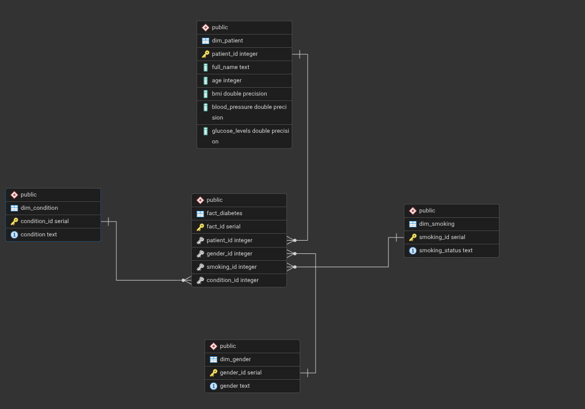

# 📊 Modelo Dimensional Diabetes Analyst

Este documento describe en detalle la **arquitectura Docker** y el **modelo dimensional (esquema estrella)** implementado en el proyecto **Diabetes Analysis**.

El Data Warehouse se construye y se carga automáticamente al ejecutar `docker compose up -d`, garantizando reproducibilidad, automatización y consistencia del entorno.

## 🏗️ Arquitectura General del Proyecto

El proyecto utiliza una arquitectura basada en contenedores Docker,
separando responsabilidades y facilitando el despliegue completo
del entorno analítico.

```text
DIABETES-ANALYSIS/
├── data/
│   ├── raw/
│   │   └── diabetes.csv
│   └── cleaned/
│       └── diabetes_cleaned.csv
│
├── docs/
│   └── images/
│       └── der_esquema_estrela.png
│
├── dw_load/
│   ├── carga_diabetes.py
│   ├── Dockerfile
│   └── requirements.txt
│
├── etl/
│   ├── 01_exploracion_data_original.ipynb
│   ├── 02_limpieza_y_transformacion.ipynb
│   ├── 03_exploracion_data_limpia.ipynb
│   └── 04_modelo_predictivo.ipynb
│
├── models/
│   └── random_forest_best.joblib
│
├── docker-compose.yml
├── README.md
├── EXPLICACION.md
├── requirements.txt
├── .env
├── .gitignore
└── LICENSE
```

## 🐳 Servicios definidos en docker-compose

### 🗄️ PostgreSQL (`db`)

- Imagen: `postgres:18`
- Función: motor de base de datos del Data Warehouse.
- Variables de entorno:
  - `POSTGRES_USER`
  - `POSTGRES_PASSWORD`
  - `POSTGRES_DB`
- Persistencia de datos mediante el volumen:
  - `postgres_diabetes_data`

### 🛠️ PgAdmin (`pgadmin`)

- Imagen: `dpage/pgadmin4`
- Función: administración visual de PostgreSQL.
- Permite:
  - Inspeccionar el esquema estrella
  - Ver tablas, relaciones y datos cargados
- Depende del servicio `db`.

### 📊 Metabase (`metabase`)

- Imagen: `metabase/metabase:latest`
- Función: herramienta de Business Intelligence.
- Se conecta a PostgreSQL para:
  - Construcción de dashboards
  - Visualización de KPIs
  - Análisis OLAP
- Utiliza el volumen persistente:
  - `metabase_diabetes_data`

### ⚙️ Servicio ETL (`etl`)

- Construido a partir del directorio `dw_load`.
- Imagen generada mediante un `Dockerfile` con Python 3.11-slim.
- Función:
  - Ejecutar automáticamente el script `carga_diabetes.py`.
  - Crear el esquema dimensional.
  - Cargar los datos en el Data Warehouse.

## 🔄 Flujo de Ejecución

Al ejecutar:

```bash
docker compose up -d
```

se produce el siguiente flujo:

1. Se inicia el contenedor PostgreSQL.
2. Se levantan PgAdmin y Metabase.
3. El contenedor `etl`:
   - Espera a que la base de datos esté disponible.
   - Ejecuta el script de carga.
   - Crea las tablas del modelo dimensional.
   - Inserta los datos en dimensiones y tabla de hechos.

## 📦 Modelo Dimensional – Esquema Estrella

El Data Warehouse implementa un **esquema estrella**, con una tabla de hechos central y múltiples dimensiones.

### DER



### Tabla de hechos

- `fact_diabetes`

### Dimensiones

- `dim_patient`
- `dim_gender`
- `dim_smoking`
- `dim_condition`

---

## 📈 Relaciones del modelo

- `fact_diabetes.patient_id` → `dim_patient.patient_id`
- `fact_diabetes.gender_id` → `dim_gender.gender_id`
- `fact_diabetes.smoking_id` → `dim_smoking.smoking_id`
- `fact_diabetes.condition_id` → `dim_condition.condition_id`

Todas las relaciones siguen un patrón **muchos-a-uno**.

## 🧠 Uso Analítico

El modelo permite:

- Segmentación de pacientes.
- Construcción de dashboards.
- Cálculo de indicadores de salud.
- Consultas OLAP y reporting.
